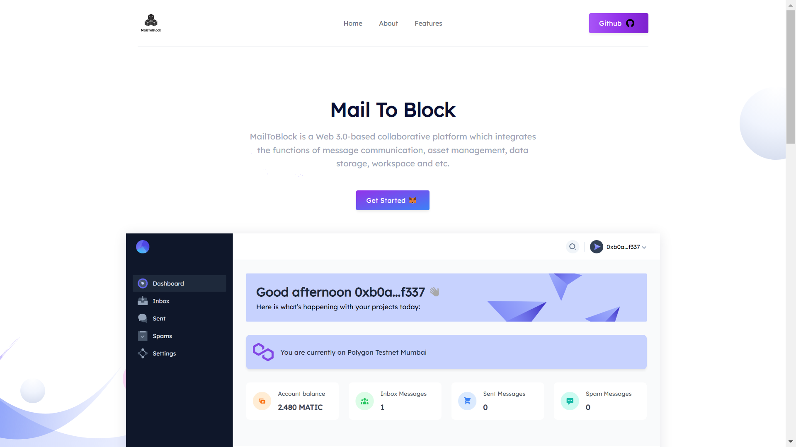
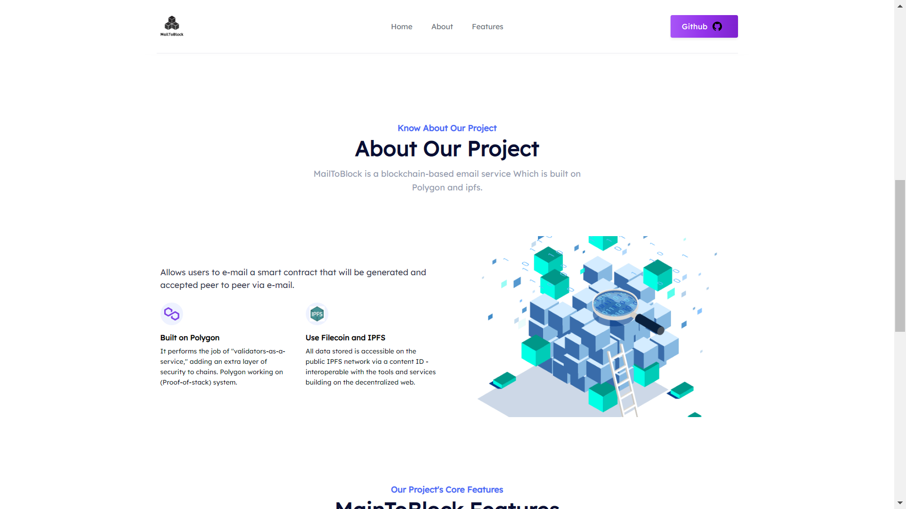
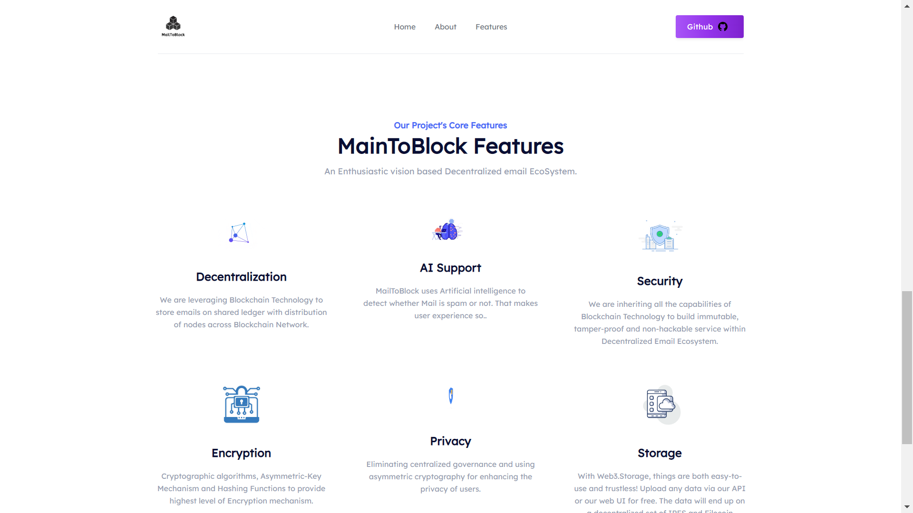
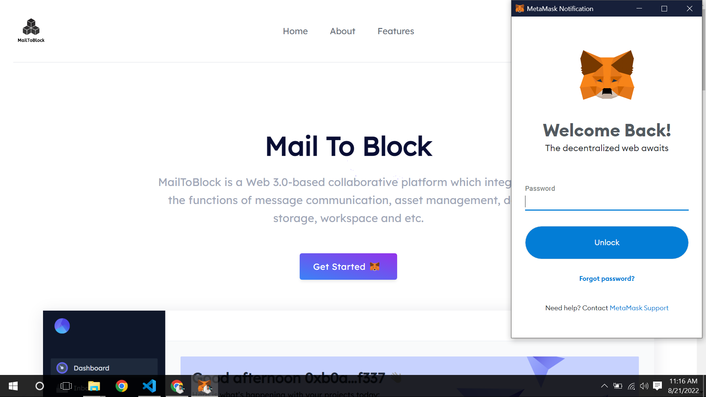
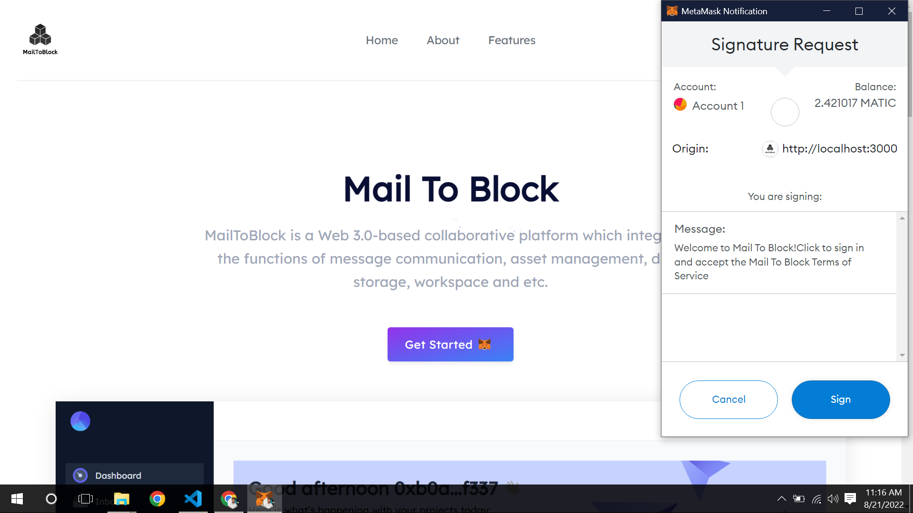
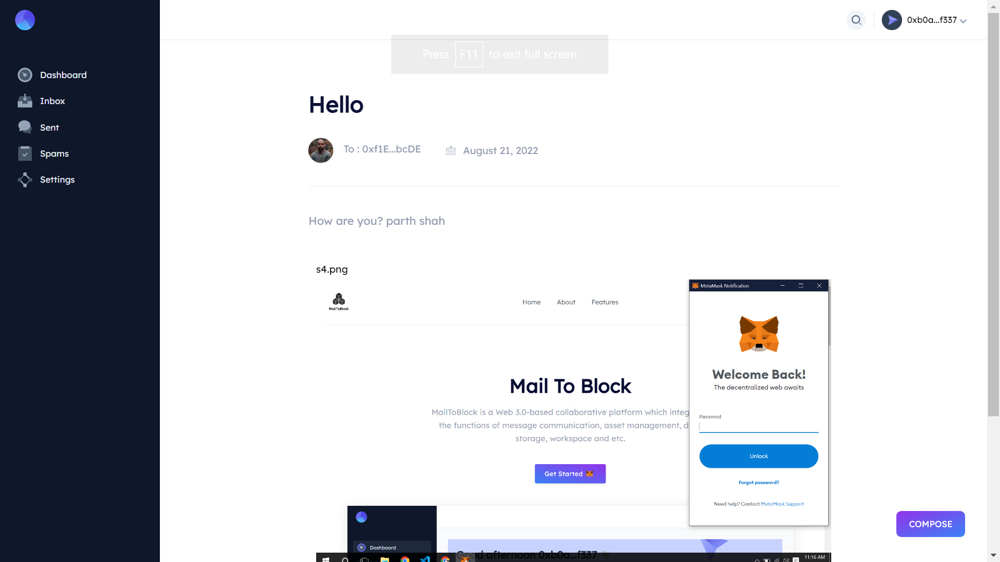
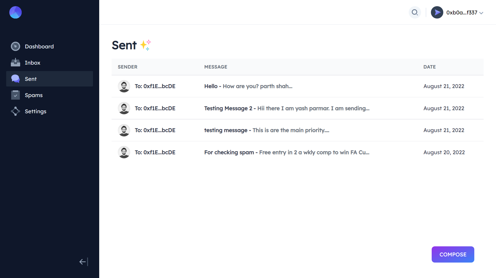
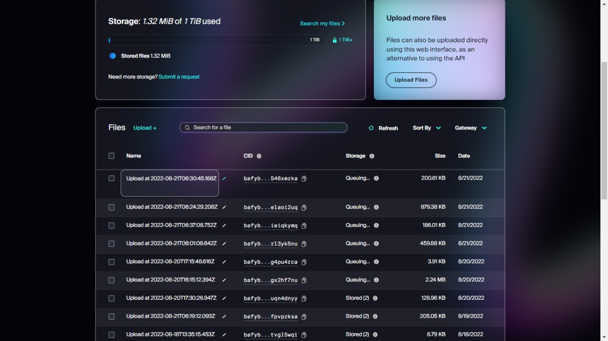

# Demo
### [🚀 ViewDemo](https://mailtoblock.vercel.app/)

# MailToBlock

- MailToBlock is a blockchain-based email service.
- Allows users to e-mail a smart contract that will be generated and accepted peer to peer via e-mail.

## Features

- Web 3.0
- Based on Ethereum Blockchain Layer 2 - Polygon
- using ipfs and filecoin to store data
- Spam email detection with Artificial Intelligence
- Deploy machine learning model using docker image via github actions
- CI/CD Pipeline
- Mails are store in the Blockchain


## Problems in legacy email providers

-  Insecure
Legacy email service providers rely on obsolete protocols, like IMAP/SMTP, which were designed and developed in 1982 and last updated in 2008.
- Centralized
Legacy email service providers are centralized. They control your data and, that means, they can lose control of your data too.
- No Privacy
Legacy email service providers like Google make their money by riffling through your data. They read your emails and analyze their contents in order to make you a better target for the ads they bombard you with. That’s their business model.
- No Encryption
Legacy email service providers either don’t offer any encryption at all or provide inadequate encryption in terms of network connection.

## How our MailToBlock solves this problems

- Replacement of traditional protocols
MailToBlock replaces Traditional protocols, Email transfer protocols such as IMAP/SMTP with immutable,revolutionary blockchain technolgy. Transfer of each email is considered as a Blockchain Transaction.
- Decentralization
MailToBlock operates on fully decentralized network where nodes are distributed across the network to form immutable network which makes it impossible to be controlled and hacked by external parties.
- Encryption
MailToBlock uses Cryptographic Algorithms with asymmetric encryption on the client side with recipients public key. The emails sent on the network are verified & authenticated for the correct recipient.


## challanges we ran into
- We use Artificial intelligence with blockchain. so that integration is difficult
- check the metamask address is valid or not.
- Making the prediction of email is spam or ham . It was a challenge making it easy to update and flexible for future needs.
- we use heroku to deploy our fast api to get prediction. but every time we changing code of model that time we redeploy our app in heroku dashboard. so we use CI/CD pipeline with github actions.
- React routing problem


## API Reference

We use fast api to deploy machine learning model.

*API* - https://spamemails.herokuapp.com

#### predict messages

```http
  POST /predict
```

| Parameter | Type     | Description                       |
| :-------- | :------- | :-------------------------------- |
| `message`      | `string` | **Required**. message to predict |


## Tech Stack

*Client:* React Js , TailwindCSS

*Backend:* Solidity, Web3 , Ethers, Polygon, hardhat,ipfs

*Artificial Intelligence:* Machine learning, Multinomialnb Algorithm, Scikit-learn

*hosting:* vercel,heroku,github actions

## Authors

- [@parthshah308](https://www.github.com/parthshah308)
- [@Yash-1511](https://www.github.com/yash-1511)


## Feedback

If you have any feedback, please reach out to us LinkedIn profile below here.
- [@parthshah308](https://www.linkedin.com/in/parth-shah-22aba6224/)
- [@Yash-1511](https://www.linkedin.com/in/yash-parmar-26744b211/)


## Screenshots








